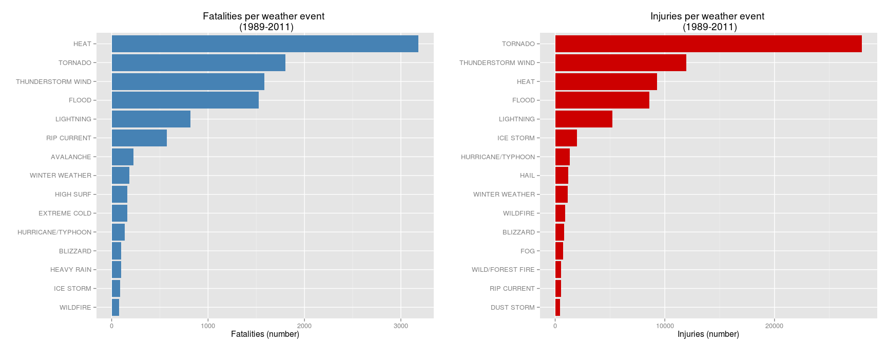
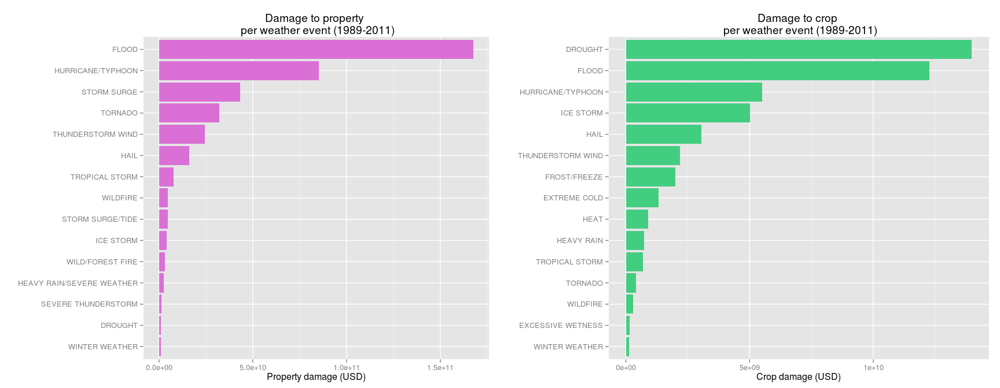

ThomasAC  
11/02/2016  

# The Impact of severe weather events on public health and economics in the United States (my Coursera Reproducible Research Assignment 2)

Created February 2016 by ThomasAC

## Synopsis

Storms and other severe weather events can cause both public health and economic problems for communities and municipalities. Many severe events can result in fatalities, injuries as well as property and crop damage. In order to better understand how to prevent such outcomes, this report aims at understanding the impact of severe weather events on public health (fatalities and injuries) and economics ( property and crop damage estimates) by exploring the U.S. National Oceanic and Atmospheric Administration's (NOAA) storm database. It appears that, over the period between 1989 and 2011, tornadoes, thunderstorms, floods and heat have a huge impact on public health, leading to high levels of both injuries and fatalities. Furthermore, tornadoes, hurricanes and floods have a high economical impact based on property and crop damage estimates. Drought and floods have the highest impact on damage to crop. This should help to prioritize resources in order to minimize the impact of such severe weather events


## Data Processing

Data originate from the U.S. National Oceanic and Atmospheric Administration's (NOAA) storm database [Storm Data](https://d396qusza40orc.cloudfront.net/repdata%2Fdata%2FStormData.csv.bz2)

Additional informations can be found at  
 * National Weather Service [Storm Data Documentation](https://d396qusza40orc.cloudfront.net/repdata%2Fpeer2_doc%2Fpd01016005curr.pdf)  
 * National Climatic Data Center Storm Events  [FAQ](https://d396qusza40orc.cloudfront.net/repdata%2Fpeer2_doc%2FNCDC%20Storm%20Events-FAQ%20Page.pdf)  

The data file is a bzip2 compressed comma-separated-value file containing records from 1950 to November 2011 (but the number of observations is much lower for early years)

### Loading the data

The following code will download the dataset in the `./data` directory and read it into R


```r
if( !file.exists("./data") ) { dir.create("./data") }
if( !file.exists("./data/repdata_data_StormData.csv.bz2") ){
    fileUrl = "https://d396qusza40orc.cloudfront.net/repdata%2Fdata%2FStormData.csv.bz2"
    download.file( fileUrl, destfile="./data/repdata_data_StormData.csv.bz2", method="curl" )
}
if( !"StormData" %in% ls() ) {
    StormData <- read.csv( file = "./data/repdata_data_StormData.csv.bz2",
                           stringsAsFactors = FALSE )
} 
```

### Selecting the data range for the anlysis

This sections aims at selecting years with sufficient observations to keep for the analysis. Here is the number of observation for each year.


```r
### Add a date column
StormData$date <- as.Date(StormData$BGN_DATE, format = "%m/%d/%Y")
### Compute nuber of observations per year
StormDataYears <- as.numeric(format(StormData$date, "%Y") )
table(StormDataYears)
```

```
## StormDataYears
##  1950  1951  1952  1953  1954  1955  1956  1957  1958  1959  1960  1961 
##   223   269   272   492   609  1413  1703  2184  2213  1813  1945  2246 
##  1962  1963  1964  1965  1966  1967  1968  1969  1970  1971  1972  1973 
##  2389  1968  2348  2855  2388  2688  3312  2926  3215  3471  2168  4463 
##  1974  1975  1976  1977  1978  1979  1980  1981  1982  1983  1984  1985 
##  5386  4975  3768  3728  3657  4279  6146  4517  7132  8322  7335  7979 
##  1986  1987  1988  1989  1990  1991  1992  1993  1994  1995  1996  1997 
##  8726  7367  7257 10410 10946 12522 13534 12607 20631 27970 32270 28680 
##  1998  1999  2000  2001  2002  2003  2004  2005  2006  2007  2008  2009 
## 38128 31289 34471 34962 36293 39752 39363 39184 44034 43289 55663 45817 
##  2010  2011 
## 48161 62174
```

Only years with more than 10000 observations (1989 to 2011) and data regarding public health (Fatalities, Injuries) and economical impact (Property and Crop damages) are kept for downstream analysis.


```r
### Subset the dataset on selected years
StormDataSub <- subset(StormData, date > as.Date("1988-12-31"))

### Subset public health and economics data
names(StormData)
```

```
##  [1] "STATE__"    "BGN_DATE"   "BGN_TIME"   "TIME_ZONE"  "COUNTY"    
##  [6] "COUNTYNAME" "STATE"      "EVTYPE"     "BGN_RANGE"  "BGN_AZI"   
## [11] "BGN_LOCATI" "END_DATE"   "END_TIME"   "COUNTY_END" "COUNTYENDN"
## [16] "END_RANGE"  "END_AZI"    "END_LOCATI" "LENGTH"     "WIDTH"     
## [21] "F"          "MAG"        "FATALITIES" "INJURIES"   "PROPDMG"   
## [26] "PROPDMGEXP" "CROPDMG"    "CROPDMGEXP" "WFO"        "STATEOFFIC"
## [31] "ZONENAMES"  "LATITUDE"   "LONGITUDE"  "LATITUDE_E" "LONGITUDE_"
## [36] "REMARKS"    "REFNUM"     "date"
```

```r
ColumnsSubset <- c("EVTYPE", "FATALITIES", "INJURIES", "PROPDMG",
                   "PROPDMGEXP", "CROPDMG", "CROPDMGEXP", "date")
StormDataSub <- StormDataSub[ , ColumnsSubset]
```

### Reduce the number of events

The National Weather Service instruction note (10-1605) suggests that 48 types of severe weather events should be recorded (table 1, section 2.1).


```r
length(unique(StormDataSub$EVTYPE))
```

```
## [1] 985
```

There are 985 different types of events recorded. By grouping related events in NWS categories, this number of events can be reduced to 210, which is more than good enough to proceed to the analysis (though 48 would have been better in real life situation).  


```r
### Convert all to upper case
StormDataSub$EVTYPE <- toupper(StormDataSub$EVTYPE)

### Replace with NWS events
StormDataSub[grep("HURRICANE|TYPHOON", 
                  StormDataSub$EVTYPE), ]$EVTYPE <- "HURRICANE/TYPHOON"
StormDataSub[grep("HEAVY.*RAIN. *HEAVY|EXCESSIVE PRECIPITATION|RECORD RAINFALL ", 
                  StormDataSub$EVTYPE), ]$EVTYPE <- "HEAVY RAIN"
StormDataSub[grep("HEAT|HOT|WARM|DRY|DRYNESS", 
                  StormDataSub$EVTYPE), ]$EVTYPE <- "HEAT"
StormDataSub[grep("HIGH * TEMPERATURE", 
                  StormDataSub$EVTYPE), ]$EVTYPE <- "HEAT"
StormDataSub[grep("FROST|FREEZE", 
                  StormDataSub$EVTYPE), ]$EVTYPE <- "FROST/FREEZE"
StormDataSub[grep("BLIZZARD", 
                  StormDataSub$EVTYPE), ]$EVTYPE <- "BLIZZARD"
StormDataSub[grep("^THUNDERSTORM|^TSTM * WIND|WINS|WIN|WND", 
                  StormDataSub$EVTYPE), ]$EVTYPE <- "THUNDERSTORM WIND"
StormDataSub[grep("^TSTM", 
                  StormDataSub$EVTYPE), ]$EVTYPE <- "THUNDERSTORM WIND"
StormDataSub[grep("FROST|FREEZE", 
                  StormDataSub$EVTYPE), ]$EVTYPE <- "FROST/FREEZE"
StormDataSub[grep("^SUMMARY", 
                  StormDataSub$EVTYPE), ]$EVTYPE <- "ToIgnore"
StormDataSub[grep("FLASH * FLOOD", 
                  StormDataSub$EVTYPE), ]$EVTYPE <- "FLASH FLOODING"
StormDataSub[grep("[^FLASH] * FLOOD", 
                  StormDataSub$EVTYPE), ]$EVTYPE <- "FLOOD"
StormDataSub[grep("FLOOD", 
                  StormDataSub$EVTYPE), ]$EVTYPE <- "FLOOD"
StormDataSub[grep("^TORNADO", 
                  StormDataSub$EVTYPE), ]$EVTYPE <- "TORNADO"
StormDataSub[grep("^TROPICAL STORM", 
                  StormDataSub$EVTYPE), ]$EVTYPE <- "TROPICAL STORM"
StormDataSub[grep("FUNNEL * CLOUD", 
                  StormDataSub$EVTYPE), ]$EVTYPE <- "FUNNEL CLOUD"
StormDataSub[grep("SURF", 
                  StormDataSub$EVTYPE), ]$EVTYPE <- "HIGH SURF"
StormDataSub[grep("SNOW|SLEET|LOW TEMPERATURE|COLD WEATHER|ICY ROAD|PROLONG COLD", 
                  StormDataSub$EVTYPE), ]$EVTYPE <- "WINTER WEATHER"
StormDataSub[grep("HAIL", 
                  StormDataSub$EVTYPE), ]$EVTYPE <- "HAIL"
StormDataSub[grep("LIGHTING|LIGHTNING", 
                  StormDataSub$EVTYPE), ]$EVTYPE <- "LIGHTNING"
StormDataSub[grep("RECORD * COLD|COOL", 
                  StormDataSub$EVTYPE), ]$EVTYPE <- "EXTREME COLD / WIND CHILL"
StormDataSub[grep("RIP * CURRENT", 
                  StormDataSub$EVTYPE), ]$EVTYPE <- "RIP CURRENT"
StormDataSub[grep("STORM * SURGE | TIDE", 
                  StormDataSub$EVTYPE), ]$EVTYPE <- "STORM SURGE/TIDE"
StormDataSub[grep("WATERSPOUT|WATER SPOUT|WAYTERSPOUT", 
                  StormDataSub$EVTYPE), ]$EVTYPE <- "WATERSPOUT"

length(unique(StormDataSub$EVTYPE))
```

```
## [1] 210
```

### Convert property and crop damage to USD on a single scale

The estimated amount of damages is reported with 3 significant digits in the damage column (PROPDMG or CROPDMG) together with a code indicated the exponent (NWS note, Section 2.7). The note states that "Alphabetical characters used to signify magnitude include “K” for thousands, “M” for millions, and “B” for billions."


```r
unique(StormDataSub$PROPDMGEXP)
```

```
##  [1] "M" "K" ""  "B" "m" "+" "0" "5" "6" "?" "4" "2" "3" "h" "7" "H" "-"
## [18] "1" "8"
```

```r
unique(StormData$CROPDMGEXP)
```

```
## [1] ""  "M" "K" "m" "B" "?" "0" "k" "2"
```

Only entries with a valid exponent code (assuming h/H for hundreds) will be kept. The others will be given a value of 0. 


```r
### The ReplaceExp function converts character to USD multiplier
ReplaceExp <- function(x){
    x[ !x %in% c("h", "H","k", "K", "m", "M", "b", "B" )  ] <- "0"
    x[ x %in% c("h", "H") ] <- "100";
    x[ x %in% c("k", "K") ] <- "1000";
    x[ x %in% c("m", "M") ] <- "1000000";
    x[ x %in% c("b", "B") ] <- "1000000000";
    x <- as.numeric(x)
}

### Replace exponent
StormDataSub$PROPDMGEXP <- ReplaceExp(StormDataSub$PROPDMGEXP)
StormDataSub$CROPDMGEXP <- ReplaceExp(StormDataSub$CROPDMGEXP)

### Calculate amount of damage for both Property and Crop
StormDataSub$PropertyDamage <- StormDataSub$PROPDMG * StormDataSub$PROPDMGEXP
StormDataSub$CropDamage <- StormDataSub$CROPDMG * StormDataSub$CROPDMGEXP
head(StormDataSub)
```

```
##                 EVTYPE FATALITIES INJURIES PROPDMG PROPDMGEXP CROPDMG
## 4039           TORNADO          0        0     2.5      1e+06       0
## 4040           TORNADO          0        0   250.0      1e+03       0
## 4041 THUNDERSTORM WIND          0        0     0.0      0e+00       0
## 4042           TORNADO          0        0     2.5      1e+06       0
## 4043 THUNDERSTORM WIND          0        0     0.0      0e+00       0
## 4044 THUNDERSTORM WIND          0        0     0.0      0e+00       0
##      CROPDMGEXP       date PropertyDamage CropDamage
## 4039          0 1989-02-20        2500000          0
## 4040          0 1989-02-20         250000          0
## 4041          0 1989-02-20              0          0
## 4042          0 1989-02-20        2500000          0
## 4043          0 1989-02-20              0          0
## 4044          0 1989-02-20              0          0
```

## Results

### Question 1 : Across the United States, which types of events (as indicated in the EVTYPE variable) are most harmful with respect to population health?

The total number of both fatalities and injuries per type of events is computed and results showed as barplots for the top 15.  


```r
### Compute number of fatalities and injuries per type of event

Fatalities <- with( StormDataSub, aggregate( FATALITIES ~ EVTYPE, FUN = "sum"))
Fatalities <- Fatalities[ order(Fatalities$FATALITIES, decreasing = TRUE), ]

Injuries <- with( StormDataSub, aggregate( INJURIES ~ EVTYPE, FUN = "sum"))
Injuries <- Injuries[ order(Injuries$INJURIES, decreasing = TRUE), ]
```
  

```r
library(ggplot2)
library(gridExtra)

fatalityPlot <- ggplot(Fatalities[1:15,], 
                       aes(x = reorder(EVTYPE, FATALITIES), 
                           y = FATALITIES) ) +
                geom_bar( stat = "identity", fill="Steelblue" ) + 
                labs(title="Fatalities per weather event \n (1989-2011)", 
                     y = "Fatalities (number)", x = "") +
                coord_flip()

injuryPlot <- ggplot(Injuries[1:15,], 
                     aes(x = reorder(EVTYPE, INJURIES),
                         y = INJURIES) ) +
              geom_bar( stat = "identity", fill="red3" ) +
              labs(title="Injuries per weather event \n (1989-2011)",
                   y = "Injuries (number)", x = "") +
              coord_flip()

grid.arrange(fatalityPlot, injuryPlot, ncol=2)
```

 

This shows that Heat, Tornadoes, Thunderstorm winds floods and lightnings have the most severe impact on public health. Tornadoes associates with high levels of both fatalities and injuries while Heat episodes have a severe impact on mortality.

### Question 2: Across the United States, which types of events have the greatest economic consequences?

The amount of property and crop damages are computed fro each type of events and results shown as a barplot for the top 15.


```r
Property <- with( StormDataSub, aggregate( PropertyDamage ~ EVTYPE, FUN = "sum"))
Property <- Property[ order(Property$PropertyDamage, decreasing = TRUE), ]

Crop <- with( StormDataSub, aggregate( CropDamage ~ EVTYPE, FUN = "sum"))
Crop <- Crop[ order(Crop$CropDamage, decreasing = TRUE), ]
```


```r
propertyPlot <- ggplot(Property[1:15,], 
                       aes(x = reorder(EVTYPE, PropertyDamage), 
                           y = PropertyDamage) ) +
                geom_bar( stat = "identity", fill="orchid" ) + 
                labs(title="Damage to property \n per weather event (1989-2011)", 
                     y = "Property damage (USD)", x = "") +
                coord_flip() 
               
cropPlot <- ggplot(Crop[1:15,], aes(x = reorder(EVTYPE, CropDamage), 
                                    y = CropDamage) ) +
            geom_bar( stat = "identity", fill="seagreen3" ) + 
            labs(title="Damage to crop \n per weather event (1989-2011)", 
                 y = "Crop damage (USD)", x = "") + 
            coord_flip()
           
grid.arrange(propertyPlot, cropPlot, ncol=2)
```

 

Floods and hurricanes (or typhoons) lead to high property and crop damage costs. Drought and high storm have a specific impact on damages to crops.

## Conclusion

Over the period between 1989 and 2011, tornadoes, thunderstorms, floods and heat have a huge impact on public health, leading to high levels of both injuries and fatalities. Tornadoes, hurricanes and floods have a high economical impact based on property and crop damage estimates. Drought and floods have the highest impact on damages to crop.

## Appendix: Session info


```r
sessionInfo()
```

```
## R version 3.2.3 (2015-12-10)
## Platform: x86_64-pc-linux-gnu (64-bit)
## Running under: Ubuntu 14.04.3 LTS
## 
## locale:
##  [1] LC_CTYPE=en_US.UTF-8       LC_NUMERIC=C              
##  [3] LC_TIME=fr_FR.UTF-8        LC_COLLATE=en_US.UTF-8    
##  [5] LC_MONETARY=fr_FR.UTF-8    LC_MESSAGES=en_US.UTF-8   
##  [7] LC_PAPER=fr_FR.UTF-8       LC_NAME=C                 
##  [9] LC_ADDRESS=C               LC_TELEPHONE=C            
## [11] LC_MEASUREMENT=fr_FR.UTF-8 LC_IDENTIFICATION=C       
## 
## attached base packages:
## [1] stats     graphics  grDevices utils     datasets  methods   base     
## 
## other attached packages:
## [1] gridExtra_2.0.0 ggplot2_1.0.1  
## 
## loaded via a namespace (and not attached):
##  [1] Rcpp_0.11.6      digest_0.6.8     MASS_7.3-44      grid_3.2.3      
##  [5] plyr_1.8.2       gtable_0.1.2     formatR_1.2      magrittr_1.5    
##  [9] scales_0.3.0     evaluate_0.7     stringi_0.4-1    reshape2_1.4.1  
## [13] rmarkdown_0.6.1  labeling_0.3     proto_0.3-10     tools_3.2.3     
## [17] stringr_1.0.0    munsell_0.4.2    yaml_2.1.13      colorspace_1.2-6
## [21] htmltools_0.2.6  knitr_1.10.5
```
